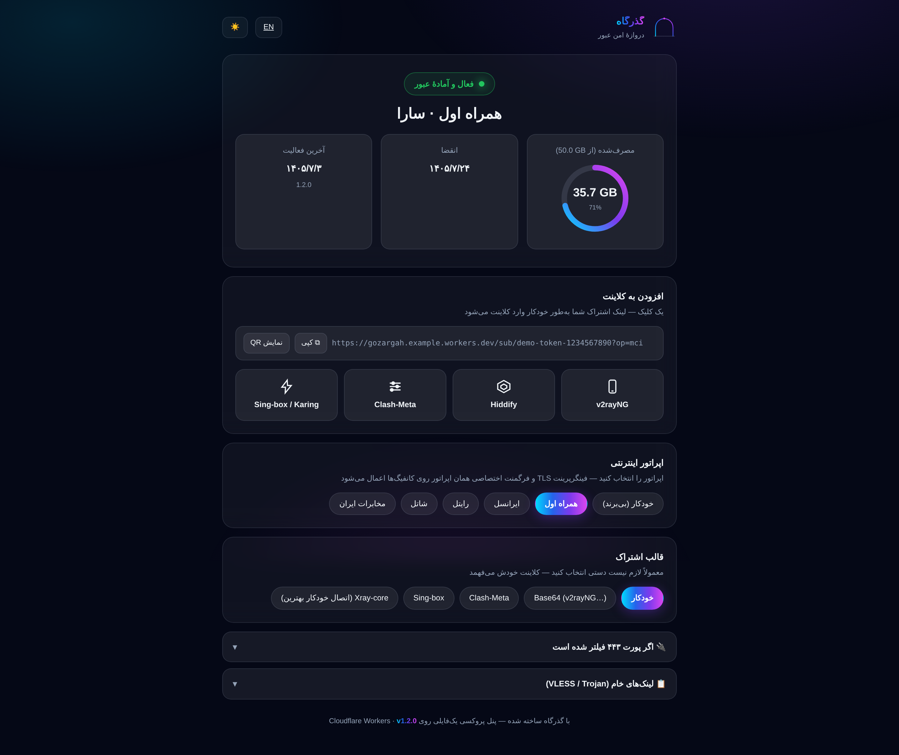

<div align="center">

<picture>
  <source media="(prefers-color-scheme: light)" srcset="docs/hero-light.svg">
  
</picture>

# گذرگاه · Gozargah

**دروازهٔ امن عبور — پنل پروکسی چندکاربره روی Cloudflare Workers**

<sub>بدون سرور · بدون هزینه · بدون وابستگی — کل پنل در یک فایل</sub>

[](https://github.com/panelgozargah/gozargah/releases/latest)
[](LICENSE)
[](https://github.com/panelgozargah/gozargah/actions/workflows/test.yml)
[](https://github.com/panelgozargah/gozargah/actions/workflows/deploy.yml)
[](https://gozargah.dpdns.org/)
[](#-چرا-گذرگاه)
[](#-سفر-یک-درخواست)
[](#-چرا-گذرگاه)
[](#-تیون-عمیق-اپراتور)
[](#-فرمت-xray--اتصال-خودکار-بهترین-مسیر)
[](#-رابط-کاربری--gozargah-nexus-ui)
[](#-چرا-گذرگاه)
[](#-رابط-کاربری--gozargah-nexus-ui)

<picture>
  <source media="(prefers-color-scheme: light)" srcset="docs/stats-light.svg">
  
</picture>


</div>

**گذرگاه** یک پنل پروکسی چندکاربرهٔ کامل است که به‌صورت بومی روی Cloudflare Workers زندگی می‌کند: یک فایل جاوااسکریپت که همه‌چیز داخلش تعبیه شده — پنل مدیریت، موتور پروکسی، اشتراک‌ساز، صفحهٔ وضعیت کاربر و تمام دارایی‌های رابط کاربری. نه سرور می‌خواهد، نه نصب، نه هزینه؛ یک اکانت رایگان کلودفلر و پنج دقیقه وقت کافی است تا یک پنل کامل با دیتابیس اختصاصی، داشبورد فارسی/انگلیسی و لینک اشتراک برای هر کاربر داشته باشید.

طراحی گذرگاه از روز اول با سه قاعده پیش رفته: **امنیت واقعی به‌جای نمایشی**، **حسابداری دقیق به‌جای تخمین**، و **مستقل بودن مطلق در زمان اجرا**. نسخهٔ ۱.۲ این قواعد را یک قدم جلوتر می‌برد: کانفیگ‌هایی که خودشان بهترین مسیر را پیدا می‌کنند، پریست‌های اختصاصی برای اپراتورهای ایران، و صفحه‌ای که کاربر شما با یک نگاه می‌فهمد «وصل هستم یا نه». نتیجه پنلی است که نه به سرویس ثالثی وابسته است، نه اطلاعات شما را از اکانت کلودفلر بیرون می‌برد و نه برای کارکردن به هیچ چیز دیگری نیاز دارد.

## ✨ چرا گذرگاه؟

<div align="center">

<picture>
  <source media="(prefers-color-scheme: light)" srcset="docs/features-light.svg">
  
</picture>

</div>

ایدهٔ پشت این دوازده کارت ساده است: هر چیزی که می‌تواند یک وابستگی، یک سرور یا یک نقطهٔ شکست باشد، حذف شده؛ و هر چیزی که تجربهٔ کاربر ایرانی را بهتر می‌کند، با دروازهٔ صداقت اضافه شده. پنل به هیچ CDNای برای دارایی‌هایش درخواست نمی‌زند، مصرف را تخمین نمی‌زند و امنیت را به ظاهر رابط کاربری گره نمی‌زند. حتی QR و فونت و آیکون‌ها داخل همان یک فایل زندگی می‌کنند.

## 📱 صفحهٔ وضعیت کاربر — یک نگاه برای «وصل شم؟»

هر کاربر یک لینک شخصی دارد؛ وقتی در مرورگر بازش کنید، به‌جای خروجی خام اشتراک، یک صفحهٔ زنده و شیشه‌ای می‌بینید: حلقهٔ مصرف با اعداد واقعی، وضعیت اتصال، انقضا، و هاب ایمپورت با دکمه‌های یک‌کلیکی برای v2rayNG، Hiddify، Clash-Meta و Sing-box. کلاینت‌های پروکسی همچنان همان خروجی خام را می‌گیرند — تشخیص خودکار از روی User-Agent.

<div align="center">



</div>

- **هاب ایمپورت:** لینک عمیق مخصوص هر کلاینت + کپی + QR تعبیه‌شده (بدون هیچ CDN)
- **سوییچ قالب:** خودکار / Base64 / Clash-Meta / Sing-box / Xray — همه با حفظ تیون اپراتور
- **چیپ‌های اپراتور:** با یک کلیک، کل صفحه و همهٔ لینک‌ها با پریست اپراتور بازسازی می‌شوند
- **درگاه‌های جایگزین:** اگر ۴۴۳ مسدود بود، لینک آمادهٔ ۲۰۵۳ / ۲۰۸۳ / ۲۰۸۷ / ۸۴۴۳
- تم روشن/تاریک، فارسی/انگلیسی، و احترام کامل به `prefers-reduced-motion`

## 🎚 تیون عمیق اپراتور

<picture>
  <source media="(prefers-color-scheme: light)" srcset="docs/operators-light.svg">
  
</picture>

هر اپراتور ایرانی رفتار DPI متفاوتی دارد؛ یک کانفیگ ثابت نمی‌تواند برای همه بهینه باشد. گذرگاه برای **همراه اول، ایرانسل، رایتل، شاتل و مخابرات** یک پریست اختصاصی ساخته: فینگرپرینت uTLS مناسب همان شبکه، پریست فرگمنت TLS داخل کپ‌های مستند Xray، و چرخ پورت‌های HTTPS کلادفلر. کافی است به لینک اشتراک `?op=mci` (یا هر اپراتور دیگر) اضافه شود.

قاعدهٔ **صداقت** سرنوشت‌ساز است: پریست فقط با انتخاب صریح کاربر اعمال می‌شود. بدون `?op=`، خروجی کاملاً خنثی و بی‌برند است — هیچ حدس ASN، هیچ برچسب غیرواقعی. و طبق درس میدانی، **ECH همیشه opt-in است** (`?ech=1`) چون DPI ایران با هندشیک‌های ECH مشکل دارد؛ پیش‌فرض در همهٔ فرمت‌ها خاموش است.

## 🧭 سفر یک درخواست

<div align="center">

<picture>
  <source media="(prefers-color-scheme: light)" srcset="docs/pipeline-light.svg">
  
</picture>

</div>

هر اتصال با یک هندشیک سبک در ورکر احراز می‌شود، مسیر کاربر از روی هاست تشخیص داده می‌شود و سپس ترافیک یا مستقیم به مقصد می‌رود یا در صورت نیاز از رلهٔ ProxyIP عبور می‌کند. همهٔ داده‌های پایدار (کاربران، مصرف، سشن‌ها، تنظیمات) در دیتابیس D1 خودتان می‌مانند و ورکر هیچ تله‌متری‌ای به بیرون نمی‌فرستد.

## ⚡ فرمت Xray — اتصال خودکارِ بهترین مسیر

فایل `xray` خروجی گذرگاه فقط لینک نیست؛ یک موتور انتخاب مسیر است. پروفایل شامل **observatory** است که هر ۳ دقیقه همهٔ مسیرها را probe می‌کند و بالانسر **leastPing** با تگ `auto-best` مسیر پیش‌فرض را به زنده‌ترین و سریع‌ترین outbound می‌برد — اگر یک مسیر throttle یا فیلتر شود، بدون هیچ دخالتی کنار می‌رود. با `?op=` یک کلون فرگمنت‌دار هم به خانواده اضافه می‌شود تا observatory آن را هم بسنجد.

## 🚀 استقرار در ۵ دقیقه

<div align="center">

<picture>
  <source media="(prefers-color-scheme: light)" srcset="docs/terminal-light.svg">
  
</picture>

</div>

فقط یک اکانت Cloudflare لازم است — **پلن رایگان کافی است**. (روش wrangler به Node.js 18+ نیاز دارد؛ روش Paste هیچ ابزاری نمی‌خواهد.)

### روش ۱ — Paste در داشبورد (بدون هیچ ابزاری)

1. فایل آمادهٔ `dist/gozargah-worker.js` را از [Releases](../../releases/latest) بردارید (یا خودتان با `npm run build` بسازید).
2. در داشبورد Cloudflare: **Workers & Pages → Create → Worker** — نام دلخواه (مثلاً `gozargah`) و Create.
3. دکمهٔ **Edit code** → محتوای فایل را جایگزین کنید → **Deploy**.
4. **ساخت دیتابیس:** **Storage & Databases → D1 → Create** — نام: `gozargah`.
5. در Worker: **Settings → Bindings → Add → D1 Database** — Variable name: دقیقاً `GZ_DB` — دیتابیس `gozargah` → Deploy.
6. صفحهٔ `https://<worker>.workers.dev/gozargah` را باز کنید — تمام! (ورود با `admin`)

> تا قبل از اتصال D1، پنل «راهنمای اتصال دیتابیس» را نشان می‌دهد و Worker در حالت بی‌دیتابیس هم پروکسی می‌کند (UUID قطعی از روی هاست).

### روش ۲ — wrangler (برای توسعه)

```bash
git clone https://github.com/panelgozargah/gozargah.git
cd gozargah
npm install
npx wrangler d1 create gozargah     # database_id را در wrangler.toml جای‌گذاری کنید
npm run deploy
```

> 🔄 **به‌روزرسانی خودکار:** در فورک خودتان دو Secret تعریف کنید — `CLOUDFLARE_API_TOKEN` و `CLOUDFLARE_ACCOUNT_ID` — از این به بعد هر push به `main` خودکار دیپلوی می‌شود.

## 🔑 ورود اولیه

| مورد | مقدار پیش‌فرض |
|------|----------------|
| آدرس پنل | `https://<worker>.workers.dev/gozargah` |
| رمز عبور | `admin` |

> ⚠️ پنل تا تغییر رمز پیش‌فرض، نوار هشدار زرد نشان می‌دهد. اولین کار بعد از ورود: **تنظیمات → رمز جدید**.
> مسیر پنل و مسیر اشتراک هم از همان‌جا قابل تغییر است.

## 👥 کاربران و اشتراک

- هر کاربر: **UUID اختصاصی + رمز Trojan + سهمیه (GB) + تاریخ انقضا + فعال/غیرفعال**
- **دو حالت انقضا:** تاریخ ثابت، یا «از اولین اتصال» — ساعت فقط وقتی شروع می‌شود که کاربر واقعاً وصل شود
- **ریست دوره‌ای مصرف:** روزانه / هفتگی / ۳۰ روزه — پنجرهٔ چرخشی بدون نیاز به Cron Worker
- مصرف واقعی up/down هر کاربر زنده در کارت او نمایش داده می‌شود (نوار گرادیانی)
- برای هر کاربر: لینک‌های VLESS/Trojan + QR + پنج لینک اشتراک + صفحهٔ وضعیت شخصی

| مسیر | توضیح |
|------|-------|
| `/{subPath}/{token}` | مرورگر ← صفحهٔ وضعیت · کلاینت ← اشتراک خودکار (UA-sniff) |
| `/{subPath}/{token}/clash` | پروفایل Clash-Meta |
| `/{subPath}/{token}/singbox` | پروفایل Sing-box |
| `/{subPath}/{token}/xray` | پروفایل Xray-core با auto-best |
| `/{subPath}/{token}/v2ray` | Base64 لینک‌ها |
| `?op=mci` | پریست اپراتور: `mci` · `irancell` · `rightel` · `shatel` · `tci` |
| `?ech=1` | فعال‌سازی ECH (opt-in — پیش‌فرض خاموش) |
| `/gozargah` | پنل (قابل تغییر) |
| `/healthz` | سلامت Worker |

## ⚙️ تنظیمات پنل

| تنظیم | پیش‌فرض | توضیح |
|-------|---------|-------|
| ProxyIPs | `proxyip.cmliussss.net` | برای اتصال به سایت‌های پشت کلادفلر؛ هر خط یک مورد. انتخاب IP برای هر کاربر پایدار است |
| مسیر اشتراک | `sub` | پیشوند لینک اشتراک |
| مسیر پنل | `gozargah` | مسیر مخفی پنل |
| ریست دوره‌ای | خاموش | صفر شدن خودکار مصرف در بازهٔ انتخابی |
| رمز عبور | `admin` | حداقل ۸ کاراکتر |

## 📱 کلاینت‌های همخوان

v2rayNG · v2rayN · Streisand · Shadowrocket · Hiddify · Clash-Meta/Stash · Sing-box · Karing · Nekobox

## 🔐 امنیت در معماری

- رمز با **PBKDF2-SHA256** و ۱۰۰٬۰۰۰ دور هش می‌شود؛ salt تصادفی ۱۶ بایتی — هیچ رمز plaintext ای در دیتابیس نیست
- سشن‌ها با **HMAC-SHA256** امضا و ۷ روزه منقضی می‌شوند؛ کوکی `HttpOnly; Secure; SameSite=Lax` — تغییر رمز همهٔ سشن‌ها را باطل می‌کند
- ورود: حداکثر ۵ تلاش در ۱۵ دقیقه — قفل **ماندگار در D1** (بر اساس هش IP)، نه حافظهٔ فرّار
- UUID و رمز Trojan هر کاربر با یک کلیک قابل چرخش است
- پاسخ همهٔ مسیرهای ناشناخته یک صفحهٔ بی‌اثر است — وجود پنل از رفتار HTTP قابل کشف نیست
- `robots.txt` بسته و همهٔ دارایی‌های UI تعبیه‌شده — هیچ ردی به سرویس ثالث

## 🧪 توسعه

```bash
npm install          # نصب وابستگی‌های توسعه
npm run typecheck    # بررسی تایپ TypeScript
npm test             # ۲۷ چک موتور: اپراتورها، فرمت‌ها، سهمیه، QR، هدرها
npm run preview      # پیش‌نمایش آفلاین پنل با دادهٔ ماک (preview.html)
npm run build        # باندل نهایی worker در dist/
```

<details>
<summary><b>🌐 English</b></summary>

**Gozargah** (Persian for *gateway*) is a complete multi-user proxy panel that runs natively on Cloudflare Workers — the entire product lives in a single JS file: admin dashboard, proxy engine, subscription generator, per-user status page and all UI assets are embedded.

- **Protocols:** VLESS & Trojan over WebSocket + TLS, per-user path detection via host header
- **Storage:** Cloudflare D1 (relational — users / events / throttle), in-isolate cache, promise-dedup, optimistic locking
- **Accounting:** real byte counting per user (up/down), live usage bars, quotas & expiry
- **Expiry modes:** fixed date **or** days-from-first-use (the clock starts on the first actual connection) + rolling auto-reset cycles (daily / weekly / 30d) — no Cron worker needed
- **Operator tuning:** explicit `?op=` presets for MCI, Irancell, Rightel, Shatel & TCI — per-ISP uTLS fingerprint, Xray-capped TLS-fragment preset and an HTTPS port wheel. Honesty gate: no preset is applied unless the user asks; ECH is strictly opt-in (`?ech=1`)
- **Xray format:** profile with observatory + leastPing balancer (`auto-best`) — a throttled path is demoted automatically; fragment clone included for operator presets
- **User status page:** browsers opening the sub link get a glassmorphic live page (real usage ring, one-tap imports, embedded QR, format switcher, operator chips, alt-port links); proxy clients keep raw configs via UA sniffing
- **Security:** PBKDF2-SHA256 (100k iterations), HMAC-signed expiring sessions, persistent D1-backed rate limiting
- **Subscriptions:** Base64 / Clash-Meta / Sing-box / Xray-core generated in-worker, auto `User-Agent` detection
- **UI:** Gozargah Nexus UI — cinematic dark glassmorphism, full RTL, FA/EN
- **Tests:** `npm test` — 27 engine checks (operators KB & caps, all formats, quota semantics, UA routing, headers, QR)

**Deploy:** grab `dist/gozargah-worker.js` from [Releases](../../releases/latest), paste it into a new Worker, create a D1 database bound as `GZ_DB`, open `https://<worker>.workers.dev/gozargah` — login `admin`. Free plan is enough.

</details>

## 🛣 نقشهٔ راه

- [x] پریست‌های اپراتورهای ایران + فرگمنت داخل کپ‌های Xray — v1.2
- [x] خروجی Xray-core با observatory و بالانسر leastPing — v1.2
- [x] صفحهٔ وضعیت کاربر با QR و ایمپورت یک‌کلیکی — v1.2
- [x] انقضای «از اولین اتصال» + ریست دوره‌ای مصرف — v1.2
- [x] ECH به‌صورت opt-in در همهٔ فرمت‌ها — v1.2
- [x] تست‌های موتور (`npm test`) — v1.2
- [ ] Shadowsocks AEAD به‌عنوان پروتکل سوم
- [ ] فوروارد UDP-DNS (پورت ۵۳) و NAT64
- [ ] ربات تلگرام با FSM روی D1
- [ ] تست‌های یکپارچگی (vitest + miniflare)

## 📄 لایسنس

MIT — آزاد برای استفاده، تغییر و توسعه. جزئیات در [LICENSE](LICENSE).

<div align="center">


<sub><b>گذرگاه</b> — دروازهٔ امن عبور · ساخته‌شده برای سرعت، سادگی و آزادی</sub>

</div>
