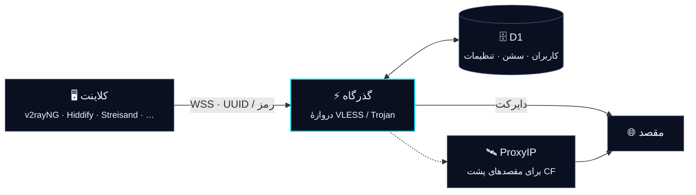
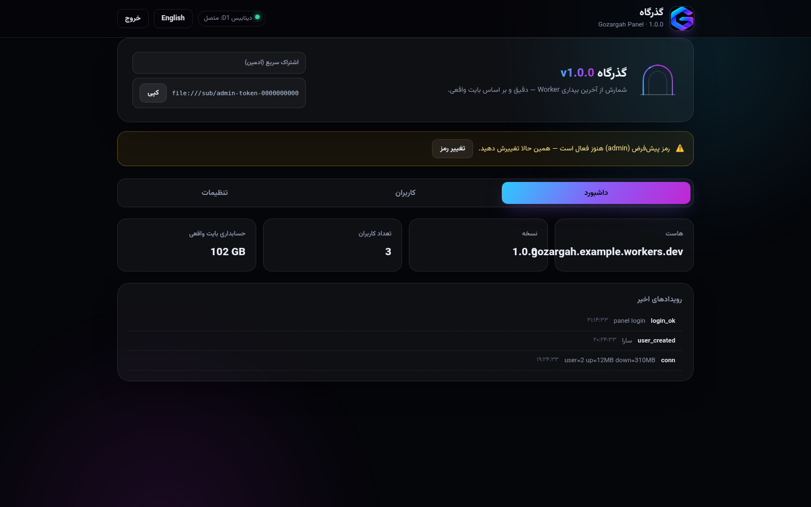
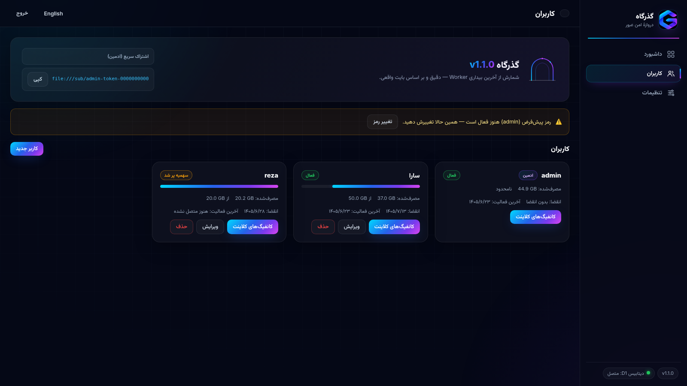
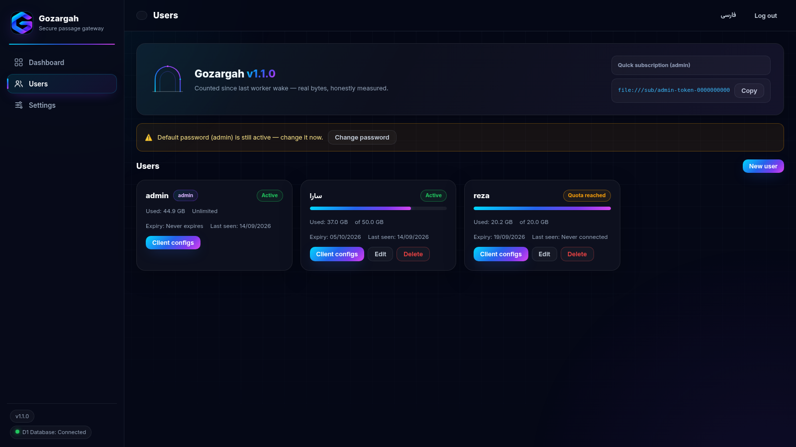
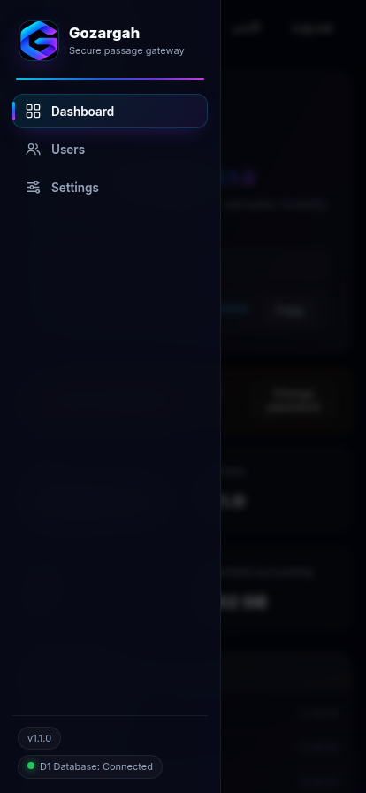

<div align="center">



# گذرگاه · Gozargah

**دروازهٔ امن عبور — پنل پروکسی چندکاربره روی Cloudflare Workers**

<sub>بدون سرور · بدون هزینه · بدون وابستگی — کل پنل در یک فایل</sub>

[](#-چرا-گذرگاه)
[](LICENSE)
[](#-چرا-گذرگاه)
[](#-معماری)
[](#-چرا-گذرگاه)
[](#-رابط-کاربری--gozargah-nexus-ui)
[](#-چرا-گذرگاه)
[](#-رابط-کاربری--gozargah-nexus-ui)


</div>

**گذرگاه** یک پنل پروکسی چندکاربرهٔ کامل است که به‌صورت بومی روی Cloudflare Workers زندگی می‌کند: یک فایل جاوااسکریپت که همه‌چیز داخلش تعبیه شده — پنل مدیریت، موتور پروکسی، اشتراک‌ساز و تمام دارایی‌های رابط کاربری. نه سرور می‌خواهد، نه نصب، نه هزینه؛ یک اکانت رایگان کلودفلر و پنج دقیقه وقت کافی است تا یک پنل کامل با دیتابیس اختصاصی، داشبورد فارسی/انگلیسی و لینک اشتراک برای هر کاربر داشته باشید.

طراحی گذرگاه از روز اول با سه قاعده پیش رفته: **امنیت واقعی به‌جای نمایشی**، **حسابداری دقیق به‌جای تخمین**، و **مستقل بودن مطلق در زمان اجرا**. نتیجه پنلی است که نه به سرویس ثالثی وابسته است، نه اطلاعات شما را از اکانت کلودفلر بیرون می‌برد و نه برای کارکردن به هیچ چیز دیگری نیاز دارد.

## ✨ چرا گذرگاه؟

| | | |
|:---:|---|---|
| ⚡ | **یک‌فایلی و بدون سرور** | کل محصول در `gozargah-worker.js`؛ هیچ پروسه، کانتینر یا سرور جداگانه‌ای در کار نیست — استقرار یعنی Paste یک فایل |
| 🛡 | **دو پروتکل، یک دروازه** | **VLESS** و **Trojan** روی WebSocket + TLS با شناسایی خودکار مسیر هر کاربر از روی هاست — بدون نگه‌داشتن وضعیت |
| 📊 | **حسابداری بایت واقعی** | مصرف up/down هر کاربر از روی طول واقعی chunkها شمرده می‌شود و زنده در کارت او نمایش داده می‌شود — نه تخمین، نه «GB قلابی» |
| 🗄 | **ذخیره‌سازی رابطه‌ای** | دیتابیس **D1** با جدول‌های مجزا (کاربران / رویدادها / throttle) + کش in-isolate و promise-dedup — نه JSON-blob های شکننده |
| 🔐 | **امنیت واقعی** | رمز با **PBKDF2-SHA256** (۱۰۰هزار دور، salt تصادفی)، سشن **HMAC امضاشده** با انقضا، rate-limit **ماندگار** در D1 |
| 🎨 | **Gozargah Nexus UI** | داشبورد شیشه‌ای با تم سینمایی، **RTL کامل**، فارسی/انگلیسی، گرادیان برند و موبایل درجه‌یک |
| 📡 | **اشتراک‌ساز داخلی** | تولید **Base64 / Clash-Meta / Sing-box** درون خود Worker — بدون سرویس ثالث، با تشخیص خودکار `User-Agent` |
| 🧩 | **صفر وابستگی رانتایم** | همهٔ دارایی‌های UI تعبیه‌شده‌اند؛ هیچ درخواستی به CDN، QR ثالث یا raw.githubusercontent زده نمی‌شود |

## 🧭 معماری

<div align="center">



</div>

هر اتصال با یک هندشیک سبک در ورکر احراز می‌شود، مسیر کاربر از روی هاست تشخیص داده می‌شود و سپس ترافیک یا مستقیم به مقصد می‌رود یا در صورت نیاز از رلهٔ ProxyIP عبور می‌کند. همهٔ داده‌های پایدار (کاربران، مصرف، سشن‌ها، تنظیمات) در دیتابیس D1 خودتان می‌مانند و ورکر هیچ تله‌متری‌ای به بیرون نمی‌فرستد.

## 🎨 رابط کاربری — Gozargah Nexus UI

رابط پنل با دیزاین‌سیستم اختصاصی **Gozargah Nexus UI** ساخته شده: تم سینمایی تیره روی `#050816`، گرادیان برند Cyan→Blue→Purple→Magenta، گلس‌مورفیسم ظریف، تایپوگرافی Inter + Vazirmatn و تجربهٔ موبایل هم‌تراز دسکتاپ.

| داشبورد (فارسی) | کاربران (فارسی) |
|---|---|
|  |  |

| کاربران (انگلیسی) | موبایل (دراور شیشه‌ای) |
|---|---|
|  |  |

| عنصر دیزاین | جزئیات |
|---|---|
| زمینه | `#050816` — آسمان شب سینمایی |
| گرادیان برند | `#00D9FF → #2563EB → #7C3AED → #D946EF` |
| چیدمان | سایدبار شیشه‌ای ثابت در دسکتاپ ← دراور کشویی در موبایل |
| RTL/LTR | فارسی پیش‌فرض RTL، انگلیسی LTR — جابه‌جایی کامل با پراپرتی‌های منطقی |
| حرکت | ترنزیشن ۱۸۰–۲۵۰ms؛ با `prefers-reduced-motion` همهٔ انیمیشن‌ها خاموش می‌شوند |
| دسترس‌پذیری | حالت فوکوس واضح، وضعیت‌ها بدون اتکای صرف به رنگ، کنتراست بالا |
| آیکون‌ها | SVG خطی درون‌سازی‌شده — بدون فونت‌آیکون و بدون درخواست خارجی |

## 🚀 استقرار در ۵ دقیقه

فقط یک اکانت Cloudflare لازم است — **پلن رایگان کافی است**. (روش wrangler به Node.js 18+ نیاز دارد؛ روش Paste هیچ ابزاری نمی‌خواهد.)

### روش ۱ — Paste در داشبورد (بدون هیچ ابزاری)

1. فایل آمادهٔ `dist/gozargah-worker.js` را از [Releases](../../releases) بردارید (یا خودتان با `npm run build` بسازید).
2. در داشبورد Cloudflare: **Workers & Pages → Create → Worker** — نام دلخواه (مثلاً `gozargah`) و Create.
3. دکمهٔ **Edit code** → محتوای فایل را جایگزین کنید → **Deploy**.
4. **ساخت دیتابیس:** **Storage & Databases → D1 → Create** — نام: `gozargah`.
5. در Worker: **Settings → Bindings → Add → D1 Database** — Variable name: دقیقاً `GZ_DB` — دیتابیس `gozargah` → Deploy.
6. صفحهٔ `https://<worker>.workers.dev/gozargah` را باز کنید — تمام! (ورود با `admin`)

> تا قبل از اتصال D1، پنل «راهنمای اتصال دیتابیس» را نشان می‌دهد و Worker در حالت بی‌دیتابیس هم پروکسی می‌کند (UUID قطعی از روی هاست).

### روش ۲ — wrangler (برای توسعه)

```bash
git clone https://github.com/panelgozargah/gozargah.git
cd gozargah
npm install
npx wrangler d1 create gozargah     # database_id را در wrangler.toml جای‌گذاری کنید
npm run deploy
```

> 🔄 **به‌روزرسانی خودکار:** در فورک خودتان دو Secret تعریف کنید — `CLOUDFLARE_API_TOKEN` و `CLOUDFLARE_ACCOUNT_ID` — از این به بعد هر push به `main` خودکار دیپلوی می‌شود.

## 🔑 ورود اولیه

| مورد | مقدار پیش‌فرض |
|------|----------------|
| آدرس پنل | `https://<worker>.workers.dev/gozargah` |
| رمز عبور | `admin` |

> ⚠️ پنل تا تغییر رمز پیش‌فرض، نوار هشدار زرد نشان می‌دهد. اولین کار بعد از ورود: **تنظیمات → رمز جدید**.
> مسیر پنل و مسیر اشتراک هم از همان‌جا قابل تغییر است.

## 👥 کاربران و اشتراک

- هر کاربر: **UUID اختصاصی + رمز Trojan + سهمیه (GB) + تاریخ انقضا + فعال/غیرفعال**
- مصرف واقعی up/down هر کاربر زنده در کارت او نمایش داده می‌شود (نوار گرادیانی)
- برای هر کاربر: لینک‌های VLESS/Trojan + QR + سه لینک اشتراک (Base64 / Clash / Sing-box)
- تشخیص خودکار فرمت اشتراک بر اساس `User-Agent` کلاینت (+ override با `/clash`، `/singbox`، `/v2ray`)

| مسیر | توضیح |
|------|-------|
| `/{subPath}/{token}` | اشتراک خودکار (UA-sniff) |
| `/{subPath}/{token}/clash` | پروفایل Clash-Meta |
| `/{subPath}/{token}/singbox` | پروفایل Sing-box |
| `/{subPath}/{token}/v2ray` | Base64 لینک‌ها |
| `/gozargah` | پنل (قابل تغییر) |
| `/healthz` | سلامت Worker |

## ⚙️ تنظیمات پنل

| تنظیم | پیش‌فرض | توضیح |
|-------|---------|-------|
| ProxyIPs | `proxyip.cmliussss.net` | برای اتصال به سایت‌های پشت کلادفلر؛ هر خط یک مورد. انتخاب IP برای هر کاربر پایدار است |
| مسیر اشتراک | `sub` | پیشوند لینک اشتراک |
| مسیر پنل | `gozargah` | مسیر مخفی پنل |
| رمز عبور | `admin` | حداقل ۸ کاراکتر |

## 📱 کلاینت‌های همخوان

v2rayNG · v2rayN · Streisand · Shadowrocket · Hiddify · Clash-Meta/Stash · Sing-box · Nekobox

## 🔐 امنیت در معماری

- رمز با **PBKDF2-SHA256** و ۱۰۰٬۰۰۰ دور هش می‌شود؛ salt تصادفی ۱۶ بایتی — هیچ رمز plaintext ای در دیتابیس نیست
- سشن‌ها با **HMAC-SHA256** امضا و ۷ روزه منقضی می‌شوند؛ کوکی `HttpOnly; Secure; SameSite=Lax` — تغییر رمز همهٔ سشن‌ها را باطل می‌کند
- ورود: حداکثر ۵ تلاش در ۱۵ دقیقه — قفل **ماندگار در D1** (بر اساس هش IP)، نه حافظهٔ فرّار
- UUID و رمز Trojan هر کاربر با یک کلیک قابل چرخش است
- پاسخ همهٔ مسیرهای ناشناخته یک صفحهٔ بی‌اثر است — وجود پنل از رفتار HTTP قابل کشف نیست
- `robots.txt` بسته و همهٔ دارایی‌های UI تعبیه‌شده — هیچ ردی به سرویس ثالث

<details>
<summary><b>🌐 English</b></summary>

**Gozargah** (Persian for *gateway*) is a complete multi-user proxy panel that runs natively on Cloudflare Workers — the entire product lives in a single JS file: admin dashboard, proxy engine, subscription generator and all UI assets are embedded.

- **Protocols:** VLESS & Trojan over WebSocket + TLS, per-user path detection via host header
- **Storage:** Cloudflare D1 (relational — users / events / throttle), in-isolate cache, promise-dedup
- **Accounting:** real byte counting per user (up/down), live usage bars, quotas & expiry
- **Security:** PBKDF2-SHA256 (100k iterations), HMAC-signed expiring sessions, persistent D1-backed rate limiting
- **Subscriptions:** Base64 / Clash-Meta / Sing-box generated in-worker, auto `User-Agent` detection
- **UI:** Gozargah Nexus UI — cinematic dark glassmorphism, full RTL, FA/EN

**Deploy:** grab `dist/gozargah-worker.js` from [Releases](../../releases), paste it into a new Worker, create a D1 database bound as `GZ_DB`, open `https://<worker>.workers.dev/gozargah` — login `admin`. Free plan is enough.

</details>

## 🛣 نقشهٔ راه

- [ ] Shadowsocks AEAD به‌عنوان پروتکل سوم
- [ ] فوروارد UDP-DNS (پورت ۵۳) و NAT64
- [ ] شروع شمارش سهمیه از اولین اتصال + ریست خودکار دوره‌ای
- [ ] ECH و fragment پریست‌های اپراتورهای ایران
- [ ] ربات تلگرام با FSM روی D1
- [ ] تست‌های خودکار (vitest + miniflare)

## 📄 لایسنس

MIT — آزاد برای استفاده، تغییر و توسعه. جزئیات در [LICENSE](LICENSE).

<div align="center">


<sub><b>گذرگاه</b> — دروازهٔ امن عبور · ساخته‌شده برای سرعت، سادگی و آزادی</sub>

</div>
